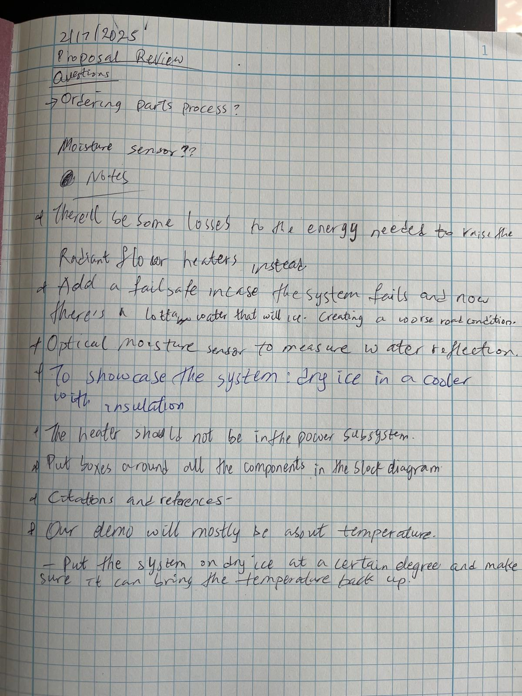
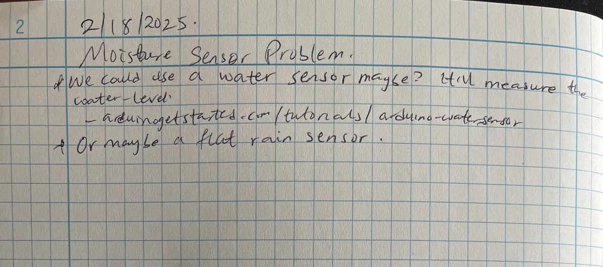
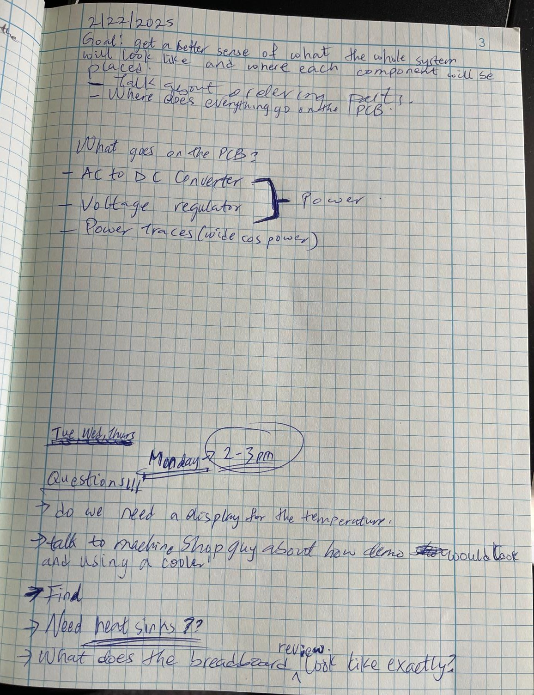
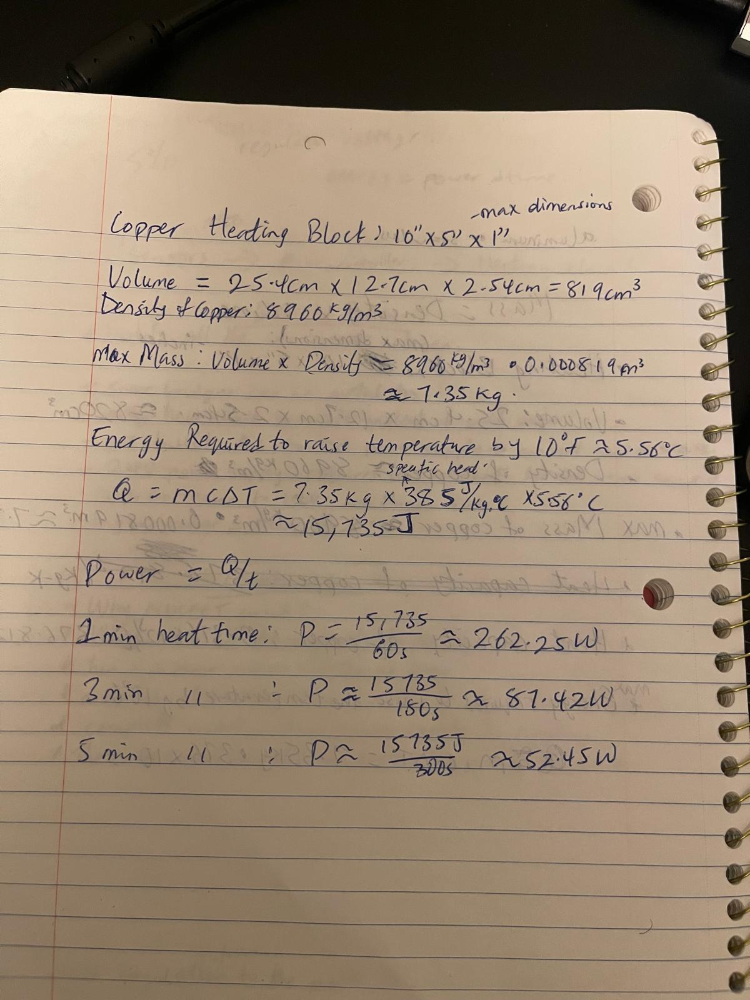
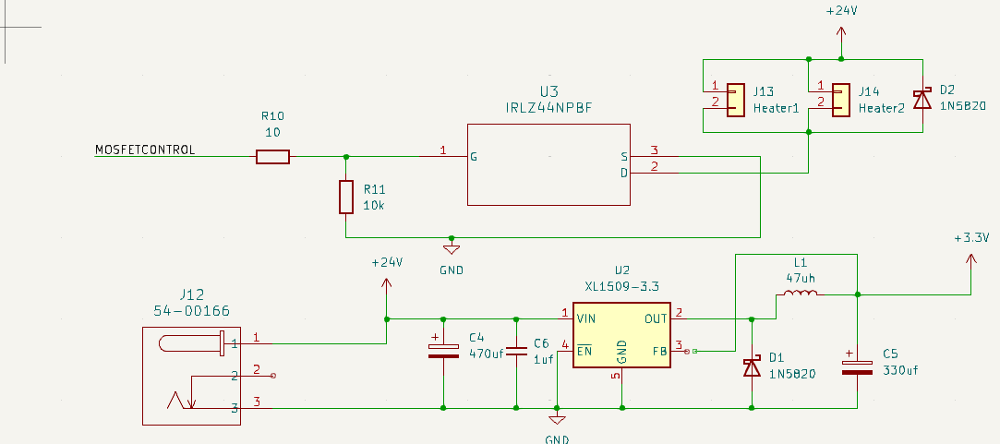
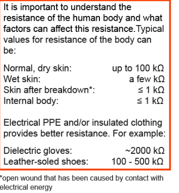
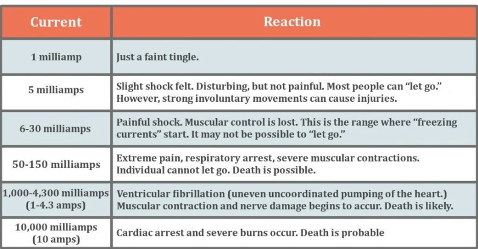

# Kahmil Worklog

<!-- TOC -->
- [Kahmil Worklog](#kahmil-worklog)
  - [Questions](#questions)
  - [2/17/2025 - Handwritten notes](#2172025---handwritten-notes)
  - [2/18/2025 - Handwritten notes](#2182025---handwritten-notes)
  - [2/22/2025 - Handwritten notes](#2222025---handwritten-notes)
  - [2/24/2025 - Meeting with machine shop/Parts for Power subsystem](#2242025---meeting-with-machine-shopparts-for-power-subsystem)
    - [Parts for Power subsystem](#parts-for-power-subsystem)
    - [Amount of Power Needed](#amount-of-power-needed)
    - [Meeting Debrief](#meeting-debrief)
    - [Next Steps](#next-steps)
  - [2/25/2025 - Trying to choose a water sensor](#2252025---trying-to-choose-a-water-sensor)
  - [2/26/2025 - TA meeting/water sensor](#2262025---ta-meetingwater-sensor)
    - [TA Meeting Debrief](#ta-meeting-debrief)
  - [2/27/2025 - Determining how much power we need](#2272025---determining-how-much-power-we-need)
    - [Fleshing out the power subsystem](#fleshing-out-the-power-subsystem)
  - [2/28/2025 -](#2282025--)
    - [Voltage Regulator vs Buck Converter](#voltage-regulator-vs-buck-converter)
    - [KiCad Shortcuts](#kicad-shortcuts)
      - [Schematic Editor](#schematic-editor)
      - [PCB Editor](#pcb-editor)
    - [PCB review session](#pcb-review-session)
  - [3/1/2025 - Power Subsystem Schematic](#312025---power-subsystem-schematic)
  - [3/2/2025 - MOSFET + Buck Converter Schematic](#322025---mosfet--buck-converter-schematic)
  - [3/5/2025 - TA meeting](#352025---ta-meeting)
    - [Questions](#questions-1)
  - [3/9/2025 - Electrical Safety: Fundamentals (Department of Research safety)](#392025---electrical-safety-fundamentals-department-of-research-safety)
    - [Do's and Don'ts](#dos-and-donts)
  - [3/10/2025](#3102025)
    - [Needed components - Power](#needed-components---power)
    - [Needed components - MCU](#needed-components---mcu)
    - [Breadboard demo](#breadboard-demo)
  - [3/11/2025](#3112025)
    - [Todo for pcb/schematic](#todo-for-pcbschematic)
  - [3/12/2025 : Research on Mosfets, gate driver, and heatsinks using ChatGPT](#3122025--research-on-mosfets-gate-driver-and-heatsinks-using-chatgpt)
    - [1. Overview](#1-overview)
    - [2. Deciding Whether to Use a Gate Driver or Heatsink](#2-deciding-whether-to-use-a-gate-driver-or-heatsink)
      - [2.1. Problem Statement](#21-problem-statement)
      - [2.2. Power Dissipation and Heatsink Requirement Calculations](#22-power-dissipation-and-heatsink-requirement-calculations)
      - [2.3. Decision](#23-decision)
    - [3. Exploring Gate Driver Options](#3-exploring-gate-driver-options)
      - [3.1. Gate Driver Explanation](#31-gate-driver-explanation)
      - [3.2. Gate Driver Selection Criteria](#32-gate-driver-selection-criteria)
      - [3.3. Gate Driver Candidates](#33-gate-driver-candidates)
      - [3.4. How to Power the Gate Driver](#34-how-to-power-the-gate-driver)
    - [4. Considering Multi-Output Buck Converters](#4-considering-multi-output-buck-converters)
    - [5. Final Decision and Next Steps](#5-final-decision-and-next-steps)
      - [Final Components Chosen](#final-components-chosen)
      - [Next Steps](#next-steps-1)
    - [Key Takeaways](#key-takeaways)
  - [3/13/2025 - Determining amount of current flowing through different part of power subsystem to determine track width](#3132025---determining-amount-of-current-flowing-through-different-part-of-power-subsystem-to-determine-track-width)
  - [3/20/2025 - Issues with large trace width](#3202025---issues-with-large-trace-width)
    - [Reasoning for Choosing CSD17312Q5](#reasoning-for-choosing-csd17312q5)
    - [Conclusion](#conclusion)
  - [Safety](#safety)

<!-- AUTO-GENERATED-CONTENT:START (TOC) -->
<!-- AUTO-GENERATED-CONTENT:END -->

## Questions

1. How many watts would we need to increase the temperature of the metal plate by 10 degrees?
2. Any guidance on the power subsystem? How do we connect to the wall?
3. **Do we need a display for temperature and moisture?**
4. Talk to machine shop about how the demo would look like and using a cooler with dry ice for demo
5. Do we need heat sinks?
6. **What does the breadboard demonstration in week 8 look like exactly?**
7. If our power supply looks like a laptop charger, how do we connect it to our system?
8. What will be the heat capacity of the material used for the surface?
9. **Can we order parts ourselves and get reimbursed?**
10. **Where are the lockers?**
11. The approprate place to add capacitors? (e.g buck converter input, output, etc.)
12. Can we actually get 3A current to the each of the heater cartridges?
13. Is there a way to increase track thickness instead of track width?

## 2/17/2025 - Handwritten notes

## 2/18/2025 - Handwritten notes

## 2/22/2025 - Handwritten notes

## 2/24/2025 - Meeting with machine shop/Parts for Power subsystem

### Parts for Power subsystem

Workflow: **Wall Outlet** -> **AC Power cord** -> **AC-DC converter (120V -> 24V)** -> **Buck Converter (24V -> 5V)**

- AC Power Cord
  - Option 1: Pre-stripped power cord [(https://www.amazon.com/Pigtail-3-Wire-Stripped-Supply-Replacement/dp/B0829LSF2F)](https://www.amazon.com/Pigtail-3-Wire-Stripped-Supply-Replacement/dp/B0829LSF2F) but safety concerns
  - Option 2: cut and strip a regular power cord to expose the three wires
  - Might need a fuse

- AC-DC converter (120V -> 24V)
  - [280W,24V](https://www.sager.com/product/gst280a24-c6p-mean-well/5359901?utm_source=googlemerchant&utm_medium=click&utm_campaign=sager-brand&utm_source=microsoft-ads&utm_medium=cpc&campaign-name=SmartShopping-NEW&utm_agid=1319416408946534&utm_term=&creative=&device=c&placement=&msclkid=8bbfccc8aff917a70a6fab7421873c48&utm_content=Ad%20group%20%231)
  - [150W,24V](https://www.sager.com/product/lrs-150-24-mean-well/5396767?utm_source=microsoft-ads&campaign-name=Search-Sager&Power&utm_agid=1313918793376081&utm_term=product%20&creative=&device=c&placement=&msclkid=6cfe252aa0721c05c83a42962f210577&utm_medium=cpc&utm_campaign=Search%20-%20Sager%20%26%20Power&utm_content=Electronics%20-%20Dynamic)
  - [120W,24V](https://trcelectronics.com/products/mean-well-gst120a24-r7b?utm_term=&utm_campaign=Sales-Performance+Max-HIGH&utm_source=bing&utm_medium=ppc&hsa_acc=9805199880&hsa_cam=20129401809&hsa_grp=1271037090758778&hsa_ad=&hsa_src=o&hsa_tgt=pla-2331239529291898&hsa_kw=&hsa_mt=e&hsa_net=adwords&hsa_ver=3&msclkid=1578a6364dad1e7983c9c18add5d6922&utm_content=Asset%20Group%201)
  - [144W,24V(top option)](https://www.amazon.com/gp/product/B0CFFBMQ6W/ref=sw_img_1?smid=A3OX6A2904ZV12&psc=1)

- Buck Converter (24V -> 5V)
  - [Option 1](https://www.amazon.com/Zixtec-LM2596-Converter-Module-1-25V-30V/dp/B07VVXF7YX/ref=sr_1_1_sspa?adgrpid=1338106215344359&dib=eyJ2IjoiMSJ9.i-fEUZUMI6-HUhAvIrsL29-8sAiPbBM2NOrzWmpKicRhKOJc89Q7s3C-mw-o6bP7y2_23eSVDDGrgKpZWt6iobrW6keTpDD50gEzcF3R3xl7l38HGH0awaiHHapeLC2wDxFhbknTLNMsKTJc1v7_PSi4KXp2FUUme7whoLVaP_lAaJXZVsZGvoEvoWVIcxYH8_4DXOMEVbF4WBjGEyH1p3xQSGN-ILX0teGRgqRg8ts.Cmr4-DlNpWikNU6o2kz8kpZiJgpuy1QVTUvAXkESvr0&dib_tag=se&hvadid=83631853424737&hvbmt=be&hvdev=c&hvlocphy=95058&hvnetw=o&hvqmt=e&hvtargid=kwd-83631983725861%3Aloc-190&hydadcr=18918_13351314&keywords=lm2596%2Bdc%2Bdc%2Bbuck%2Bconverter&mcid=adfbc3c395583070af1c1c8c87dfef6f&msclkid=ab1bf28172511d781971953de778885b&qid=1740412209&sr=8-1-spons&sp_csd=d2lkZ2V0TmFtZT1zcF9hdGY&th=1)

### Amount of Power Needed
We need to consider the amount of power neededby our system in order to choose the right power supply and other components.
We need to know the heat capacity of the material used for the surface, the mass of the material, and the temperature change needed.
The following formulas will be useful:

- Power (P) = Energy (E) / Time (t)
- Energy (E) = Heat (Q) = Mass (m) * Specific Heat (c) * Temperature Change (ΔT)

### Meeting Debrief
- We talked to Gregg at the machine shop about the overall design and we were able to get a better understanding of the system. We talked about the materials to use for the bridge surface and also introduced the idea of a heating block that would be right under the bridge surface. 
- We decided on 10inch x 5inch x 1/8inch steel plate for the bridge surface.
- We havent decided on the material for the heating block yet because we have to consider the diameter of the heater cartridges to know how thick it would be. However, the length and width of the heating block would be the same or a bit less than the bridge surface.
- We also talked about the idea of a thermacouple to measure the temperature of the bridge surface and the heating block.

### Next Steps
- Choose a heater cartridge so we can determine the size of the heating block.
- Look into thermocouple and how it will work with our system.

## 2/25/2025 - Trying to choose a water sensor
- Had a meeting today to start working on PCB design, however most of the time was spent trying to choose a water sensor because we thought it would be helpful to know the specs of the water sensor to have a more accurate schematic.
- The goal of the sensor is to be able to detect snowfall (in the real world) and sprayed water (in the demo)
- We found "soil moisture sensors" but I don't think they will work because we want to detect liquid water, not just moisture in the soil.
- We found optical sensors which use reflection to detect the presence of water but the fact that our bridge is made of steel might affect the accuracy of the sensor.
- We also found water level sensors but we won't have a puddle of water on the bridge so I don't think this will work.
- We also looked at humidity sensors but we don't want to just detect the amount of moisture in the air, we want to detect liquid water.
- The ideal sensor would be able to detect if it touches water without being submerged in water or being placed on the surface of the bridge (because in the real world, cars will step on it). We would want something that is mounted above the bridge surface and can detect being touched by sprayed water (or snow in the real world).

## 2/26/2025 - TA meeting/water sensor
- I found a rain sensor that would seem perfect however it is very big and expensive. I think it might be more suitable for industrial applications. However, It's able to detect when water is sprayed on it. [RG-11 Rain sensor](https://rainsensors.com/products/rg-11/). [Youtube demo](https://www.youtube.com/watch?v=BxVbIZfC324)
- I also found this rain sensor on digikey however I don't know how if it can detect snow in the real world. [Rain sensor - digikey](https://www.digikey.com/en/products/detail/soldered-electronics/333044/21720441)
- I also found this sensor that seems to work for both rain and snow but it's expensive (41 USD) and looks industrial. Also it arrives really late. [Rain/Snow sensor - Amazon](https://www.amazon.com/Raindrops-Detection-Automatic-Heating-Outdoor/dp/B0CHMH3JKN?utm_source=chatgpt.com)
- I also found this [rain/snow sensor - Ebay](https://www.ebay.com/itm/115096071033?utm_source=chatgpt.com)
- I'm having trouble finding a sensor that can detect both snowfall and sprayed water (for the demo). So maybe we will just have two sensors, one for snowfall and one for sprayed water.

### TA Meeting Debrief
- For the breadboard demo, we should try to get the sensors working with the dev board and also get some of the heating elements working.
- Our locker is G10
- Verified that we can indeed use a dev board for the breadboard demo
- Can submit the parts request from myECE

## 2/27/2025 - Determining how much power we need
- From my calculations (shown in the image below), we would need around 260W of power to raise the temperature of the bridge surface by 10 degrees farenheight in 60 seconds and ~90W to raise it by 10 degrees in 3 minutes.
- This should be possible to do with the 144W power supply we are considering. [24V, 6A, 144W power supply adapter(5.5mm x 2.1mm)](https://www.amazon.com/dp/B0CFFBMQ6W?psc=1&smid=A3OX6A2904ZV12&ref_=chk_typ_imgToDp)
  

### Fleshing out the power subsystem
- The current plan is to use the AC-DC converter (linked above) to step down the voltage from the wall outlet to 24V. Then we will use a buck converter (LM2596) to step down the voltage to 3.3V.
- We will use the 3.3V rail to power the ESP32 and the 24V rail to power the heating elements.
- The 24V rail will first go to the MOSFET (IRLZ44NPBF) which will be controlled by the ESP32.
- The MOSFET will be used to control the amount of current that will flow to the heating elements.
- We will be using heater cartridges for the heating elements. We will probably use 3 [40W, 24V cartridges](https://www.amazon.com/dp/B0BQQ4KGCB?smid=ALO3XPILH8M0H&ref_=chk_typ_imgToDp&th=1) to meet the amount of power needed to raise the temperature of the bridge surface.
- We might also need a heatsink and a gate driver circuit (LTC1157) to control the MOSFET.

## 2/28/2025 - 
### Voltage Regulator vs Buck Converter
"A linear regulator (e.g., an AMS1117-3.3) simply "burns off" the extra voltage as heat. For a drop from 24V to 3.3V, that’s a loss of 20.7V, which can result in significant heat dissipation, especially at higher currents.
A buck converter uses switching elements (transistors, diodes, inductors, and capacitors) to efficiently convert the voltage with efficiencies often above 85–90%, meaning much less energy is wasted as heat." Source: ChatGPT

### KiCad Shortcuts
#### Schematic Editor
- Hit a to open the component add dialog / footprint library.
- Move components around by hovering over them with the mouse and pressing g (grab). Components can be copied with c.
- Use w to start routing a new wire under the mouse, left-click to finish routing, and Esc to cancel.
- Use r to rotate a component.
- Use l to place labels on pins or wires. Any two points with the same label will behave as if connected by a wire.
- "Set the value of the resistor to 10k and the capacitor to 1uF by hovering over each and pressing v."
#### PCB Editor
- x - Add track
- v - Toggle front/back side of board
- u - Select all segments of a track
- Del - Delete selected track segments
- b - redraw zones (after moving footprints or tracks)

### PCB review session
- Avoid 90 degree bends in the wiring traces
- Make sure you can hand solder the components (0805 recommended)
- Look into using 4 layer PCBs?
- Consider using a 28V power supply instead of 24V just for complexity (and add a linear regulator)
- KiCad has a built in calculator to see how wide the traces should be depending on the current.
- Read the PDF on the PCB design guidelines

## 3/1/2025 - Power Subsystem Schematic
- ""105" is a standard capacitor code. In this case, the "105" indicates that the capacitor's value is 1 µF. Here's how it works: the first two digits (10) are the significant figures and the third digit (5) is the multiplier (i.e. add five zeros) in picofarads. So, 10 × 10⁵ pF equals 1,000,000 pF, which is equivalent to 1 µF." Source: ChatGPT
- ""0603" and "0805" refer to standard SMD (surface-mount device) package sizes. They denote the length and width of the component in inches:

0603: Approximately 0.06" x 0.03" (roughly 1.6 mm x 0.8 mm)
0805: Approximately 0.08" x 0.05" (roughly 2.0 mm x 1.25 mm)" Source: ChatGPT
- Diodes: The side with the hook or straight line is the cathode (negative).
- For the Barell connector, we only need the top and bottom pin of the symbol.
- The IRLZ44NPBF is an N-channel MOSFET.

## 3/2/2025 - MOSFET + Buck Converter Schematic
- Coming up with these schematics was a real pain. I'm still not sure if I did it correctly. I had thought thet you can just connect the mosfet and converter directly but it seems you need resistors, capacitors, and diodes. I'm still not sure what each of those components do but I will look into it.
- Here's what the power subsystem looks like as of now:

- The following resources were helpful:
  - [Mosfet as a switch](https://www.youtube.com/watch?v=UJkHL-6mn8s&t=769s)
  - [Cadlab Buck Converter schematic](https://cadlab.io/project/27732/master/files/BUCK-CONVERTER.kicad_pro)
- We were able to order a PCB for the first round PCBway orders but we dont think it'll work because there were a few issues we didn't fix before ordering:
  - The power lines were not rated for 6A, the max we had was 3A.
  - We probably need some decoupling capacitors.
  - We also wanna isolate the 3.3V from the buck converter so we can test the sensing subsystem and the power subsystem independently.

## 3/5/2025 - TA meeting
- There's a group doing an Athletic Tracking Sensor project. I think we have some similar components and functionality so we can talk to them.
- Ask ECE supply shop for buck converter and do it for the breadboard demo
### Questions
- Can you review our PCB design?
- What do we need for the breadboard demo?
- Discuss with the TA about tolerance analysis section

## 3/9/2025 - Electrical Safety: Fundamentals (Department of Research safety)
- Water droplets = charges, gravity/height = voltage, water flowing = current
- Why birds don't get electrocuted on power lines: If the bird's feet are on the same wire, there's no difference in voltage so no current flows through the bird. If the bird comes in contact with two wires at different voltages, current will flow (higher to lower voltage) through the bird bcos there's now a potential difference (between its wing and feet).
- Voltage is relative, it's the difference in potential energy between two points.
- Standard wall outlets in North America produce 110-120V AC at 60Hz.
- AC is used because it can be easily transformed (stepped up or down) to reduce power loss in the transmission and distribution lines.
- In DC circuits, current flows in only one direction and the voltage does not oscillate.
- Increasing voltage applied to the circuit while maintaining same resistance will result in an increase in current.
- 
- Ground Fault Circuit Interrupter (GFCI) - the test and reset buttons on power outlets. They should be tested every six months.
- If your body is in contact with a lower voltage or if you are grounded, you can become a path for current to flow if you touch a higher voltage or live conductor.
- Having wet skin, clothing or standing on wet floors increases your chances of getting shocked.
- You can feel a shock at 5mA, At 6mA letting go can become difficult.
- If someone can't let go, you should shut off power to the circuit immediately.
- Ask yourself: Am I grounded? If so current can flow from a circuit, through you, to the ground.
- You can be grounded when:
  - You are standing on a non-insulating floor surface (e.g. concrete, metal, tile, stone etc.)
  - You're standing in or near water
  - Youre in close proximity to water pipes or touching a large solid piece of metal like desk, table, cabinet, equipment rack, etc.
  - You're in contact with the grounded "side" of your circuit.
- You can insulate yourself by:
  - Wearing rubber soled shoes
  - Standing on non-conductive mats
  

### Do's and Don'ts
- Don't use two-to-three prong adapters because they remove the ground connection.
- Don't touch where current is passing or live conductors?

## 3/10/2025 
### Needed components - Power
- 1 barrel connector (54-00166)
- 3 Capacitors (470uf,330uf, 1uf)
- Buck Converter (XL1509-3.3)
- 1 inductor (47uH)
- 2 diodes (IN5820, MBR745)
- 3 2-pin connector for buck converter output and heaters
- 3 Resistors (10k, 1k, 10ohm)
- Mosfet (IRLB8743PBF)
- 
- Wires that can handle at least 6A of current.
### Needed components - MCU
- 3 220ohms resistors
- 4 100ohms resistors
- 2 10k ohms resistor
- 3 1uF capacitor
- 5 2-pin connector for boot button, en_button sensor LEDs (2.54mm)
- 3 3-pin connectors for temperature sensors and uart
- 2 4-pin connector for rain sensor and jtag
- ESP32-WROOM-32E or ESP32-WROOM-32UE

### Breadboard demo
- I was able to wire up the prebuilt buck converter (and it worked) but I was told it'd be better to not use a pre made module. So we have to build the buck converter ourselves on the pcb.
- We did have an incident where there was smoke coming from the breadboard when I was trying to convert 24V to 3.3V using the prebuilt module. Maybe 24V is too much for the breadboard
- We also need to explain how the rain sensor works in our report.
- All in all, the demo went well.

## 3/11/2025
- A buck converter is a type of switching voltage regulator
- Use a buck converter that supplies atleast 1 amps so it can effectively power the esp32 and sensors

### Todo for pcb/schematic
- Determine if we need a heatsink for the MOSFET.
- Do we need something to increase the voltage so the mosfet can be turned on?
- Add test points
- Increase trace width for 6A of current
- separate the 3.3V output from the buck converter for easy debugging
- Decoupling capacitors?

## 3/12/2025 : Research on Mosfets, gate driver, and heatsinks using ChatGPT

### 1. Overview
In this session, I analyzed the best approach for **driving a MOSFET** in my project, considering **gate drive voltage, power dissipation, heatsink requirements, and the feasibility of using a gate driver**. I also explored options for **buck converters** to power both the **ESP32 and the gate driver** from a single power supply.

---

### 2. Deciding Whether to Use a Gate Driver or Heatsink

#### 2.1. Problem Statement
- The **ESP32 outputs only 3.3V** on its GPIO pins.
- The **IRLZ44NPBF MOSFET** is logic-level but achieves lowest **R_DS(on) at 10V gate drive**, meaning 3.3V **may not fully turn it on**.
- **Potential problems with using 3.3V drive directly:**
  - Higher R_DS(on) → Increased heat dissipation.
  - Higher conduction losses → Potentially reduced heater power.
  - **Question:** Should I use a **gate driver** to boost the voltage or just add a **heatsink**?

#### 2.2. Power Dissipation and Heatsink Requirement Calculations
For **IRLZ44NPBF** at **3.3V gate drive (6A current)**:
- **Estimated R_DS(on)** at 3.3V: ~**35mΩ**  
- **Power Dissipation**:
  $$
  P = I^2 \times R_{DS(on)}
  $$
  $$
  P = (6A)^2 \times 0.035Ω = 1.26W
  $$
- **Junction Temperature Calculation**:
  $$
  \Delta T = P \times R_{\theta JA}
  $$
  $$
  \Delta T = 1.26W \times 62°C/W = 78.1°C
  $$
  $$
  T_{\text{junction}} = 25°C + 78.1°C = 103.1°C
  $$
  - **103.1°C is too hot** → A **heatsink would be required** if sticking with IRLZ44NPBF at 3.3V.

For **IRLB8743PBF** at **3.3V gate drive (6A current)**:
- **Estimated R_DS(on)** at 3.3V: **6mΩ**  
- **Power Dissipation**:
  $$
  P = (6A)^2 \times 0.006Ω = 0.216W
  $$
- **Junction Temperature Calculation**:
  $$
  \Delta T = 0.216W \times 62°C/W = 13.4°C
  $$
  $$
  T_{\text{junction}} = 25°C + 13.4°C = 38.4°C
  $$
  - **38.4°C is very low** → **No heatsink required**.

#### 2.3. Decision
- **IRLZ44NPBF at 3.3V is inefficient** (too hot).
- **IRLB8743PBF at 3.3V works well without a heatsink**.
- **Conclusion:** **Switch to IRLB8743PBF** instead of using a gate driver or heatsink.

---

### 3. Exploring Gate Driver Options

#### 3.1. Gate Driver Explanation
- A **gate driver** replaces the **3.3V input from the ESP32** with a higher **V_GS (e.g., 10V)** to fully enhance the MOSFET.
- **How it works:**
  - **ESP32 GPIO (3.3V)** → **Gate Driver Input**
  - **Gate Driver Output (10V–12V)** → **MOSFET Gate**
- This ensures **low R_DS(on)** and minimal heating.

#### 3.2. Gate Driver Selection Criteria
- **Must accept 3.3V logic input.**
- **Must output at least 10V.**
- **Must provide at least 1-2A drive current** to switch the MOSFET efficiently.

#### 3.3. Gate Driver Candidates  
| Gate Driver | Input Voltage | Output Voltage | Peak Current | Notes |
|-------------|--------------|---------------|-------------|--------|
| **TC4420** | 3.3V logic | Up to 18V | 6A | Most recommended |
| **IR4427** | 3.3V logic | Up to 20V | 1.5A | Lower drive capability but works |
| **IXDN602** | 3.3V logic | Up to 35V | 2A | Supports direct 24V operation |

#### 3.4. How to Power the Gate Driver
- **Gate driver output voltage = V_DD**
- If I want **10V output**, I must **power the gate driver with 10V**.
- **Possible power sources:**
  - **10V buck converter** (preferred for efficiency).
  - **12V regulator (7812) with a diode drop to 10V**.
  - **Resistor-Zener voltage drop from 24V** (simpler but less efficient).

---

### 4. Considering Multi-Output Buck Converters
- Instead of **adding a second buck converter**, I looked into whether a **single buck converter with both 3.3V and 10V outputs** could work.
- **Challenges:**
  - The **XL1509-3.3** I’m using only provides **one fixed output (3.3V)**.
  - Dual-output buck converters **exist but are rare** and may require additional configuration.
- **Conclusion:** Using two separate buck converters (one for 3.3V, one for 10V) is the easiest solution if I stick with a gate driver.

---

### 5. Final Decision and Next Steps
#### Final Components Chosen
- **MOSFET:** **IRLB8743PBF** → Fully turns on at 3.3V, so no gate driver needed.
- **No heatsink needed** → Power dissipation is only **0.216W**.
- **Power Supply Configuration:**
  - **ESP32 powered by XL1509-3.3 buck converter (24V → 3.3V).**
  - **Gate driver option removed, since IRLB8743PBF can be driven directly**.

#### Next Steps 
- Update **KiCad schematic** to use **IRLB8743PBF** instead of **IRLZ44NPBF**.
- If unexpected heating occurs, re-evaluate **adding a gate driver**.

---

### Key Takeaways
1. **IRLZ44NPBF at 3.3V runs too hot (103°C), requiring a heatsink or gate driver.**
2. **IRLB8743PBF at 3.3V runs cool (38.4°C), making it the best choice.**
3. **Switching to IRLB8743PBF eliminates the need for both a gate driver and a second buck converter.**
4. **No additional power dissipation concerns—efficiency remains at ~99.85%.**

## 3/13/2025 - Determining amount of current flowing through different part of power subsystem to determine track width
- 6A (141mils): wires that go from Power supply to the two heaters, heaters to mosfet drain, mosfet source to ground, the diode in parallel with the heaters.
- 3A (54mils): wires that go to each heater in parallel
- Use normal wires (20mils) for the buck converter and the mosfet input
- I chnaged the freewheeling diode to a mbr745 because it has higher ratings.

## 3/20/2025 - Issues with large trace width
When I started wiring up the PCB, I encountered a lot of programs with making the trace widths (145mils) fit so I had to change some of my components to achieve the desired connections. I chose wider heater connectors and another mosfet with even lower heat dissipation and wide enough footprint for my large tracewidths. A breif jusftification for choosing the CSD17312Q5 mosfet is below (with the hep of chatgpt).

### Reasoning for Choosing CSD17312Q5
The **CSD17312Q5** MOSFET was selected to be driven directly by the **ESP32 (3.3V logic)** without requiring a gate driver. Key factors for suitability include:

- **Low Gate Threshold Voltage (V_GS(th))**:  
  - Starts turning on at **0.9V – 1.5V** (typical **1.1V**).
  - Fully operational at **3.3V**, ensuring the ESP32 can drive it directly.

- **Low On-Resistance (R_DS(on)) at 3V Gate Drive**:  
  - **1.8 mΩ at V_GS = 3V**, leading to minimal conduction losses.
  - At **6A**, power dissipation is:  
    $$
    P = I^2 \times R_{DS(on)} = (6A)^2 \times 1.8mΩ = 0.065W
    $$
  - **No heat sink required** at this power level.

- **Gate Charge (Q_g) is Manageable for ESP32**:  
  - **28 nC at 4.5V** → ESP32 can switch it, though not as fast as a dedicated gate driver.
  - Suitable for low-frequency switching applications.

- **Thermal Performance is Sufficient**:  
  - Thermal resistance **R_θJA = 49°C/W**.  
  - Junction temperature at **6A**:
    $$
    T_J = T_A + (P \times R_{\theta JA}) = 25°C + (0.065W \times 49) = 28.2°C
    $$
  - **Very low temperature rise → No need for additional cooling.**

### Conclusion
- The **ESP32 can drive the CSD17312Q5 directly at 3.3V** without a gate driver.  
- **Minimal power dissipation** (~0.065W at 6A), so **no heat sink is needed**.  

## 3/24/25: TA meeting questions + PCB checks
### TA meeting
- Can we use content/paragraphs from design doc for the individual report? What if it's sections that we wrote personally.

### PCB checks
- Make sure the trace widths for the buck converter vin is large enough
- Make sure the buck converter can produce enough current to power the mcu and sensors
- Verify the fact that the mosfet ground (carrying 6A) is connected to the ground plane
- Test points
- Scatter vias all around the PCB.

## Safety

- Wall outlet voltage (120V AC or 230V AC) is deadly.
  - Always use insulated wires, power supplies, and fuses.
- Current above 30mA can be fatal.
  - Ensure proper insulation and grounding in your circuits.
- Use a fuse or circuit breaker to prevent excessive current flow.
  - Example: 5A fuse for AC input, 10A fuse for 24V heater circuit.
- Never work on live circuits.
  - Always unplug the system before making changes.
  Source: ChatGPT

- 
Source: https://www.scienceabc.com/humans/how-many-volts-amps-kill-you-human.html

